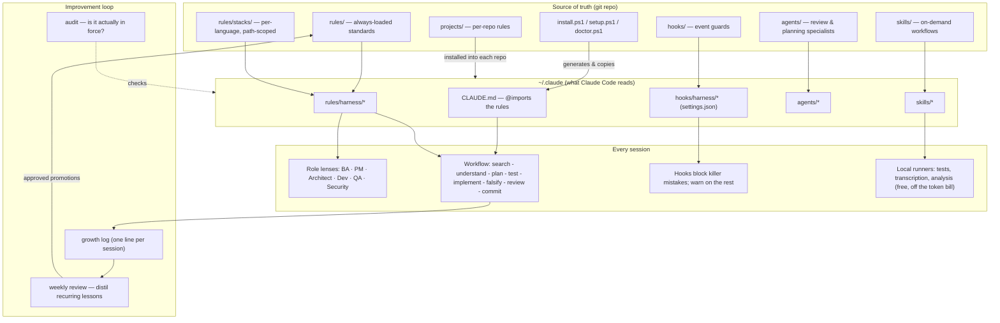

# Claude Code Harness

A personal operating system for [Claude Code](https://claude.com/claude-code):
install your way of working **once**, and the agent follows it in every session —
instead of re-explaining it in every prompt.

> Optimize the context window. Persist everything else.

This repository is the **public guide** to the harness: what it is, why it exists,
the problems it solves, and how to stand one up yourself, step by step. It is
documentation and a reusable pattern — not anyone's private configuration.

---

## Why this exists — the problem

Working with a capable coding agent, the same friction shows up every day:

- **Context resets each session.** You re-explain your conventions, your stack's
  traps, your commit rules — every time. The agent has no memory of *how you work*.
- **Discipline is inconsistent.** Sometimes it plans and tests; sometimes it jumps
  to code. Rules you stated last week are gone.
- **The same mistakes recur.** A build trap, an encoding pitfall, a test that
  passes while broken — hit once, forgotten, hit again.
- **Quality isn't enforced, only hoped for.** "Please add tests" is a wish, not a
  guarantee.
- **Cost creeps.** Long tool output, huge transcripts, and many parallel agents
  burn tokens with little to show.

The harness turns "how I work" into installed, enforced configuration: rules that
load every session, hooks that block known mistakes, roles and skills that shape
the work, and a feedback loop that turns recurring lessons into new rules.

## Goals

1. **Consistency** — the same workflow, standards, and guardrails in every session.
2. **Enforcement, not hope** — mechanical guards for the mistakes that actually
   cost time.
3. **Low cost** — heavy work runs locally and for free; the agent reads summaries,
   not raw firehoses.
4. **Portability** — rebuild the whole setup on a new machine, or hand it to a
   teammate, with a couple of commands.
5. **Self-improvement** — the system gets sharper from use, on a weekly cadence.

## What it's built from

The harness adapts ideas from **[ECC](https://github.com/affaan-m/ecc)** (MIT) and
composes with community plugins like Superpowers. It does not install any of them
wholesale — it takes the structure and keeps the footprint small.

---

## Architecture



### The pieces

| Layer | What it does |
|---|---|
| **Rules** (`rules/*.md`) | Always-loaded standards — workflow, testing, review, style, git, security, performance, design, UI, memory, roles. Wired into `~/.claude/CLAUDE.md` via `@import` so they load every session. |
| **Stacks** (`rules/stacks/*`) | Per-language conventions and traps, imported only inside a project that uses that stack — so context stays lean. |
| **Hooks** (`hooks/*`) | Event guards. Blocking hooks stop the mistakes that cost time (bad commits, destructive commands); warning hooks nudge. Each is tested to prove it actually blocks. |
| **Agents** (`agents/*`) | Review and planning specialists invoked by name. |
| **Skills** (`skills/*`) | On-demand workflows: local test runners, media/knowledge ingestion, research, a multi-role review pass, onboarding a new stack, a weekly improvement review, and more. |
| **Projects** (`projects/*`) | Per-repository rules, installed into each repo's own (git-ignored) config so a project's specifics travel with it. |
| **Scripts** | `setup.ps1` (prerequisites), `install.ps1` (generate + copy, idempotent, backs up), `install-projects.ps1`, `doctor.ps1` (drift check), `test-hooks.ps1` (prove hooks block), an audit (is it in force?). |

### How rules actually load

Claude Code does not auto-load an arbitrary rules folder. The installer wires the
always-loaded rules into `~/.claude/CLAUDE.md` with `@import` lines (which Claude
Code loads every session), and puts per-project/stack rules into a repo's own
`.claude/CLAUDE.md` so they load only inside that project. The git repo stays the
single source of truth; `~/.claude/` is generated from it and never hand-edited.

---

## Design principles

- **One source of truth.** Edit the repo, run the installer; never hand-edit the
  live config. A rule's text lives in exactly one place.
- **Enforce mechanically where it's cheap.** A hook that blocks a known-bad action
  beats a rule the agent might forget. Prove each guard actually fires.
- **Local and free by default; the cloud is opt-in.** Test runs, media
  transcription, and bulk analysis run on the machine with local models — zero API
  cost — and the agent consumes small summaries, not raw output. Private data
  never leaves the machine unless you explicitly choose a cloud step.
- **Small context.** Path-scoped stack rules, summaries over firehoses, sequential
  role-lenses over parallel agents unless parallelism truly pays.
- **Extensible, not over-fitted.** Adding a new language or domain is a thin
  path-scoped layer, added in minutes and retired when the interest ends — never a
  rewrite.
- **The system improves from use.** A one-line lesson per session; a weekly review
  promotes what recurs into a rule.

## Problems it solves (concretely)

| Problem | The harness's answer |
|---|---|
| Conventions re-explained every session | Always-loaded rules via `@import` |
| Discipline drifts | A fixed workflow rule + a planning/roles pass |
| The same trap recurs | Stack "traps" sections + a weekly review that promotes them |
| Quality is hoped for | Blocking hooks + mandatory review + an audit |
| Wrong-author / unwanted attribution in commits | A commit hook that enforces authorship |
| Destructive commands slip through | A hook that blocks them unless explicitly intended |
| Big test/tool output burns tokens | Local runners return a fixed-size summary |
| Analyzing lots of material is expensive | Local models do it for free; the agent only synthesizes |
| A new machine means re-doing everything | `setup` + `install` rebuild it in minutes |

---

## Get started (step by step)

> Prerequisites: Claude Code 2.1+, Git, and (on Windows) PowerShell 5.1+.
> `setup.ps1` installs the rest. This guide shows the shape; adapt paths to your OS.

**1. Clone your harness repo**
```bash
git clone <your-harness-repo>
cd <your-harness-repo>
```

**2. Provision the prerequisites (idempotent — skips what you have)**
```powershell
.\setup.ps1
```
Installs the toolchain the optional local skills use (a JS runtime, a Python
runner, media tools, a local LLM runtime + model). Nothing is required for the
core rules/hooks — this only enables the local, free skills.

**3. Install the harness into your Claude config**
```powershell
.\install.ps1                      # uses your defaults
.\install.ps1 -Author "Your Name" -Email "you@example.com"   # or set identity
```
It backs up your existing config, copies the rules/hooks/agents/skills into
`~/.claude/`, and wires the always-loaded rules into `CLAUDE.md`. Re-run any time;
it's idempotent and tracks what it manages for a clean uninstall.

**4. (Optional) Install per-project rules into your repos**
```powershell
.\install-projects.ps1
```

**5. Verify**
```powershell
.\doctor.ps1        # installed == repo, hooks registered
.\test-hooks.ps1    # every blocking hook actually blocks
```

**6. Use it** — open Claude Code. The rules load, the hooks are live, the skills
are available. Point it at a task and it follows your workflow.

**7. Keep it sharp** — end each session with a one-line lesson in a growth log; run
the weekly review to promote what recurs into a rule.

## Making it your own

- **Rules** are plain Markdown — edit them, re-run `install.ps1`.
- **Add a stack** with the onboarding skill: a path-scoped rules file (idioms,
  security, testing, traps) and optionally a reviewer agent.
- **Identity is parameterized** (`-Author`/`-Email`), and generic rules avoid
  personal specifics, so the harness is shareable.
- **Keep secrets out of the repo** — use environment variables; keep sensitive
  outputs in a git-ignored folder.

## Status

Actively used and maintained as a personal system; this public guide documents the
pattern so others can build their own. Contributions to the documentation are
welcome via issues.

## License

MIT. Built by adapting MIT-licensed prior art (ECC); see that project for its own
terms.
