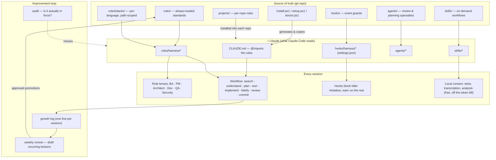
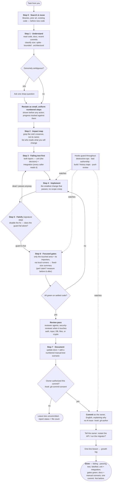

# Claude Code Harness

A personal operating system for [Claude Code](https://claude.com/claude-code):
install your way of working **once**, and the agent follows it in every session —
instead of re-explaining it in every prompt.

> Optimize the context window. Persist everything else.

This repository is the **public guide** to the harness: what it is, why it exists,
how it is built, how to stand one up yourself, and — plainly — **what data leaves
your machine and what does not**. It is documentation and a reusable pattern, not
anyone's private configuration.

**Contents:** [Why](#why-this-exists) · [What you get](#what-you-get) ·
[Architecture](#architecture) · [The path a task takes](#the-path-a-task-takes) ·
[Design principles](#design-principles) · [Privacy & data flow](#privacy--data-flow) ·
[Requirements](#requirements) · [Get started](#get-started) ·
[Optional & opt-in skills](#optional--opt-in-skills) · [Make it your own](#make-it-your-own) ·
[Update, verify & uninstall](#update-verify--uninstall) · [Limitations](#limitations--honesty) ·
[License](#license)

---

## Why this exists

Working with a capable coding agent, the same friction shows up every day:

- **Context resets each session.** You re-explain your conventions, your stack's
  traps, your commit rules — every time. The agent has no memory of *how you work*.
- **Discipline is inconsistent.** Sometimes it plans and tests; sometimes it jumps
  straight to code. Rules you stated last week are gone.
- **The same mistakes recur.** A build trap, an encoding pitfall, a test that
  passes while broken — hit once, forgotten, hit again.
- **Quality isn't enforced, only hoped for.** "Please add tests" is a wish, not a
  guarantee.
- **Cost creeps.** Long tool output, huge transcripts, and many parallel agents
  burn tokens with little to show.

The harness turns "how I work" into installed, enforced configuration: rules that
load every session, hooks that block known mistakes, roles and skills that shape
the work, and a feedback loop that turns recurring lessons into new rules.

### Goals

1. **Consistency** — the same workflow, standards, and guardrails every session.
2. **Enforcement, not hope** — mechanical guards for the mistakes that cost time.
3. **Low cost** — heavy work runs locally and free; the agent reads summaries, not
   raw firehoses.
4. **Portability** — rebuild the whole setup on a new machine with a couple of
   commands.
5. **Self-improvement** — the system sharpens from use, on a weekly cadence.

It adapts ideas from **[ECC](https://github.com/affaan-m/ecc)** (MIT) and composes
with community plugins like Superpowers. It installs none of them wholesale — it
takes the structure and keeps the footprint small.

---

## What you get

| Layer | What it does |
|---|---|
| **Rules** (`rules/*.md`) | Always-loaded standards — workflow, testing, review, style, git, security, performance, design, UI, memory, roles. Wired into `~/.claude/CLAUDE.md` via `@import` so they load every session. |
| **Stacks** (`rules/stacks/*`) | Per-language conventions and traps, imported only inside a project that uses that stack — so context stays lean. |
| **Hooks** (`hooks/*`) | Event guards. Blocking hooks stop costly mistakes (bad commits, destructive commands); warning hooks nudge. Each is tested to prove it actually blocks. |
| **Agents** (`agents/*`) | Review and planning specialists invoked by name. |
| **Skills** (`skills/*`) | On-demand workflows: local test runners, media/knowledge ingestion, research, a multi-role review pass, stack onboarding, a weekly improvement review, a model-consult second opinion, an optional local text-to-speech skill, and more. |
| **Projects** (`projects/*`) | Per-repository rules, installed into each repo's own (git-ignored) config so a project's specifics travel with it. |
| **Scripts** | `setup.ps1` (prerequisites), `install.ps1` (generate + copy, idempotent, backs up), `install-projects.ps1`, `doctor.ps1` (drift check), `test-hooks.ps1` (prove hooks block), an audit. |

### How rules actually load

Claude Code does not auto-load an arbitrary rules folder. The installer wires the
always-loaded rules into `~/.claude/CLAUDE.md` with `@import` lines (which Claude
Code loads every session), and puts per-project/stack rules into a repo's own
`.claude/CLAUDE.md` so they load only inside that project. The git repo stays the
single source of truth; `~/.claude/` is generated from it and never hand-edited.

---

## Architecture


```mermaid
graph TD
  subgraph SOT["Source of truth (git repo)"]
    RULES["rules/ — always-loaded standards"]
    STACKS["rules/stacks/ — per-language, path-scoped"]
    HOOKS["hooks/ — event guards"]
    AGENTS["agents/ — review & planning specialists"]
    SKILLS["skills/ — on-demand workflows"]
    PROJECTS["projects/ — per-repo rules"]
    INSTALL["install.ps1 / setup.ps1 / doctor.ps1"]
  end

  subgraph CC["~/.claude (what Claude Code reads)"]
    CLAUDEMD["CLAUDE.md — @imports the rules"]
    RH["rules/harness/*"]
    HH["hooks/harness/*  (settings.json)"]
    AH["agents/*"]
    SH["skills/*"]
  end

  subgraph RUNTIME["Every session"]
    LENS["Role lenses: BA · PM · Architect · Dev · QA · Security"]
    WF["Workflow: search - understand - plan - test - implement - falsify - review - commit"]
    GUARD["Hooks block killer mistakes; warn on the rest"]
    LOCAL["Local runners: tests, transcription, analysis (free, off the token bill)"]
  end

  subgraph LEARN["Improvement loop"]
    LOG["growth log (one line per session)"]
    REVIEW["weekly review — distil recurring lessons"]
    AUDIT["audit — is it actually in force?"]
  end

  INSTALL -->|generates & copies| CLAUDEMD
  RULES --> RH
  STACKS --> RH
  HOOKS --> HH
  AGENTS --> AH
  SKILLS --> SH
  PROJECTS -->|installed into each repo| CC

  CLAUDEMD --> WF
  RH --> WF
  RH --> LENS
  HH --> GUARD
  SH --> LOCAL

  WF --> LOG
  LOG --> REVIEW
  REVIEW -->|approved promotions| RULES
  AUDIT -.checks.-> CC
```

---

## The path a task takes

The architecture shows the *pieces*. This shows the *flow* — what happens, in
order, from the moment you give the agent a task to a committed change. The harness
intercepts at each step: rules shape it, hooks guard it, local runners keep it cheap.


```mermaid
flowchart TD
  START([Task from you]) --> S0

  S0["<b>Step 0 · Search &amp; reuse</b><br/>libraries, prior art, existing code — before new code"] --> S1
  S1["<b>Step 1 · Understand</b><br/>read code, docs, recent commits<br/>classify size: spike · bounded · architectural"] --> AMB
  AMB{"Genuinely ambiguous?"}
  AMB -->|yes| ASK["Ask one sharp question"] --> RESTATE
  AMB -->|no| RESTATE
  RESTATE["<b>Restate as small, uniform numbered steps</b><br/>shown before any action; progress tracked against them"] --> S2

  S2["<b>Step 2 · Impact map</b><br/>grep the rule's essence, not its name;<br/>list who reads what you will change"] --> S3
  S3["<b>Step 3 · Failing test first</b><br/>both layers — unit (the decision) +<br/>integration (every caller reads it)"] --> S4
  S4["<b>Step 4 · Implement</b><br/>the smallest change that passes; no scope creep"] --> S5
  S5{"<b>Step 5 · Falsify</b> (signature step)<br/>disable the fix — does the guard fail alone?"}
  S5 -->|"dead / passes anyway"| S3
  S5 -->|"guard is live"| S6

  S6["<b>Step 6 · Focused gates</b><br/>only the touched area + its importers,<br/>via local runners → fixed-size summary<br/>(perf claim? measure before &amp; after)"] --> GREEN
  GREEN{"All green on settled code?"}
  GREEN -->|no| S4
  GREEN -->|yes| REVIEW
  REVIEW["<b>Review pass</b><br/>reviewer agents; security-reviewer when it touches<br/>auth, input, DB, files, or crypto"] --> S7

  S7["<b>Step 7 · Document</b><br/>update docs + add a numbered manual-test scenario"] --> CONSENT
  CONSENT{"Owner authorized this commit?<br/><i>hook: git-commit-consent</i>"}
  CONSENT -->|no| WAIT(["Leave tree uncommitted · report status + file count"])
  CONSENT -->|yes| COMMIT["<b>Commit</b> as the owner, English, explaining why<br/>no AI trace &nbsp;<i>hook: git-author</i>"]
  COMMIT --> MIGRATE["Tell the owner: restart the API / run the migrator?"]
  MIGRATE --> LESSON["One-line lesson → growth log"]
  LESSON --> DONE(["<b>Done</b> — failing→passing test, falsified; unit + integration;<br/>gates green; docs + manual scenario; one commit. Not before."])

  GUARD[["Hooks guard throughout:<br/>destructive-ops · bad authorship ·<br/>build / history traps · push review"]]
  GUARD -.watches.-> S4
  GUARD -.watches.-> S6
  GUARD -.watches.-> COMMIT
```

Weekly, the growth log feeds the **improvement loop**: recurring lessons are
distilled and — with your approval — promoted into a rule, so the path itself gets
smarter over time.

---

## Design principles

- **One source of truth.** Edit the repo, run the installer; never hand-edit the
  live config. A rule's text lives in exactly one place.
- **Enforce mechanically where it's cheap.** A hook that blocks a known-bad action
  beats a rule the agent might forget. Prove each guard actually fires.
- **Local-first; the cloud is opt-in.** Tests, transcription, and bulk analysis run
  on the machine with local models — and the agent reads small summaries, not raw
  output. Data leaves the machine only on a step you explicitly choose (see below).
- **Small context.** Path-scoped stack rules, summaries over firehoses, sequential
  role-lenses over parallel agents unless parallelism truly pays.
- **Route by stakes, never trade accuracy for tokens.** Correctness-bearing work
  (architecture, logic, security, the falsify step) stays on the strongest model;
  only low-stakes, verifiable work is offloaded to local or cheaper models. The
  final decision stays with you and the main agent — a second model is a check, not
  an author.
- **Extensible, not over-fitted.** A new language or domain is a thin path-scoped
  layer, added in minutes and retired when the interest ends.
- **The system improves from use.** One lesson per session; a weekly review promotes
  what recurs into a rule.

---

## Privacy & data flow

**Read this before trusting the word "local".** The harness is honest about where
data goes.

**The baseline you cannot opt out of.** The harness runs *on* Claude Code, which is
Anthropic's agent. Your prompts, the files the agent reads, and the tool output it
sees are sent to **Anthropic** to produce responses. That is inherent to using
Claude Code; this layer does not change it. If that matters for a given codebase,
it is a decision about using Claude Code at all, not about this harness.

**On top of that baseline, the harness is local-first and cloud only when you opt
in, per step:**

| Component | Where your data goes | Default |
|---|---|---|
| Rules, hooks, agents, the installer | Nowhere — plain local config/text | — |
| Local test runners (Playwright / .NET / pytest) | Stay on the machine; the agent reads a fixed-size summary | local |
| **media-ingest** transcription (faster-whisper) + analysis (Ollama) | Stay on the machine; local models, no network | local |
| **media-ingest `--engine groq`** | Audio sent to **Groq** (cloud) | **off** (opt-in flag) |
| **consult** skill | Prompt sent to **Google (Gemini API)**; the free tier **may use your prompts to improve Google's models** | you invoke it; non-sensitive only |
| **narrate** skill (optional) | A separate local app (**VoiceStudio**, AGPL-3.0) on `localhost` — no cloud, but you install/run it yourself | off (opt-in) |
| Companion plugins / external agent runners | Depend on the model you point them at (see below) | you install them |

**Guidance baked into the rules:** sensitive or proprietary work stays on the
**local** path (Ollama / faster-whisper); the cloud steps above are for
non-sensitive content and are never automatic. Nothing here adds telemetry.

**Secrets.** API keys live in environment variables or git-ignored files (e.g. a
`.gemini_key` file); `.gitignore` excludes them, and the author/commit hooks keep
them out of commits. Rotate anything that is ever exposed.

**External tools are your responsibility.** The companion plugins and agent runners
below are **not bundled** — you install them, and their privacy is theirs. Under
Claude Code, a plugin that "uses the model" uses Anthropic. Point provider-agnostic
runners (Pi, Orca) at a **local** model to keep data on the machine, or at a cloud
provider if you choose. Google Antigravity is cloud (Gemini) by default.

---

## Requirements

- **Claude Code 2.1+**, **Git**, and (on Windows) **PowerShell 5.1+**. The scripts
  are PowerShell; adapt paths/commands for macOS/Linux.
- The **core** (rules, hooks, agents) needs nothing else.
- The **optional local skills** need what `setup.ps1` provisions: a JS runtime, a
  Python runner (`uv`), media tools (`ffmpeg`, `yt-dlp`), and a local LLM runtime
  (Ollama) + a model. All free; all local.

---

## Get started

**1. Clone the repo**
```bash
git clone <your-harness-repo>
cd <your-harness-repo>
```

**2. Provision prerequisites (idempotent — skips what you have)**
```powershell
.\setup.ps1
```
Installs the toolchain the optional local skills use. Nothing here is required for
the core rules/hooks.

**3. Install the harness into your Claude config**
```powershell
.\install.ps1                                               # uses defaults
.\install.ps1 -Author "Your Name" -Email "you@example.com"  # set your identity
.\install.ps1 -Skills narrate                               # also enable an opt-in skill
```
It backs up your existing config, copies the rules/hooks/agents/skills into
`~/.claude/`, wires the always-loaded rules into `CLAUDE.md`, and tracks everything
it writes for a clean uninstall. Re-run any time — it's idempotent.

**4. (Optional) Install per-project rules into your repos**
```powershell
.\install-projects.ps1
```

**5. Verify**
```powershell
.\doctor.ps1        # installed == repo, hooks registered, optional skills reported
.\test-hooks.ps1    # every blocking hook actually blocks
```

**6. Use it** — open Claude Code. Rules load, hooks are live, skills are available.

**7. Keep it sharp** — end each session with a one-line lesson in a growth log; run
the weekly review to promote what recurs into a rule.

---

## Optional & opt-in skills

Some skills are **off by default** (marked `optional: true`) and some reach a cloud
service, so you turn them on deliberately.

- **Opt-in install mechanism.** `install.ps1` skips `optional: true` skills unless
  you pass `-Skills <name>` (or `-WithOptional`); re-running without the flag
  removes a previously installed one. `doctor.ps1` reports an off optional skill as
  clean, not drift. This is how you enable/disable a component — and the data a UI
  toggle would read.
- **consult** — a concise second opinion from a Gemini model (Google AI Studio).
  Advisor only; the main agent and you decide. Default model is a **free** flash
  tier; a paid model is **refused** unless you opt in; the key is read from an env
  var or a git-ignored file. Prompts go to Google — **non-sensitive only** (see
  Privacy).
- **narrate** *(optional)* — speak text to a local audio file via **VoiceStudio**
  (a separate AGPL-3.0 app you install, on `localhost`). Health-checked first; it
  refuses the first model download until you authorize it. Local, no cloud.

### Companion plugins & agent runners (external, not bundled)

The harness composes with open-source tools instead of reinventing them. They
install through their own mechanisms — **not** `install.ps1` — and the harness
references them from its role lenses and rules. `setup.ps1 -Companions` prints the
commands.

| Tool | Role | Install | License |
|---|---|---|---|
| [diagram-design](https://github.com/cathrynlavery/diagram-design) | Editorial architecture / flow / sequence / state diagrams (HTML+SVG); redraws Mermaid & draw.io | `/plugin marketplace add cathrynlavery/diagram-design` | MIT |
| [Understand-Anything](https://github.com/Egonex-AI/Understand-Anything) | Codebase → interactive knowledge graph (uses the host model — point it at a local model for privacy/cost) | `/plugin marketplace add Egonex-AI/Understand-Anything` | MIT |
| [impeccable](https://github.com/pbakaus/impeccable) | UI review — deterministic checks + live browser iteration | `/plugin marketplace add pbakaus/impeccable` (or `npx impeccable install`) | Apache-2.0 |
| [taste-skill](https://github.com/Leonxlnx/taste-skill) | Design "taste" for generated frontends | `npx skills add https://github.com/Leonxlnx/taste-skill` | MIT |
| [Pi](https://pi.dev) / [Orca](https://github.com/orca-cli/orca) | Provider-agnostic agent CLIs — run a local model (Ollama) for free, private, multi-step work; Orca isolates agents in git worktrees | see their docs | MIT |

Each keeps its own license and updates upstream — the harness documents and wires
them, it does not vendor them. Installing and trusting them is your call.

---

## Make it your own

- **Rules** are plain Markdown — edit them, re-run `install.ps1`.
- **Add a stack** with the onboarding skill: a path-scoped rules file (idioms,
  security, testing, traps) and optionally a reviewer agent.
- **Identity is parameterized** (`-Author`/`-Email`), and generic rules avoid
  personal specifics, so the harness is shareable.
- **Keep secrets out of the repo** — environment variables or git-ignored files.

---

## Update, verify & uninstall

- **Update:** `git pull`, then `.\install.ps1` to regenerate `~/.claude/`.
- **Verify:** `.\doctor.ps1` (drift) and `.\test-hooks.ps1` (guards fire).
- **Uninstall:** the installer records everything it writes in a manifest and backs
  up `CLAUDE.md`/`settings.json` before each run, so removal is clean. Your own
  edits and other tools' files are never touched.

---

## Limitations & honesty

- **It is Windows/PowerShell-first.** The scripts assume PowerShell 5.1; other
  platforms need light adaptation.
- **"Local and free" has one asterisk** — the Claude Code baseline above. Local
  models are also **weaker** than frontier models; the harness routes correctness
  to the strong model and only offloads low-stakes work.
- **Hooks reduce mistakes, they don't eliminate them.** They block known classes of
  error; judgment and review still matter.
- **Companion tools are external and unverified by this repo.** Review and trust
  them yourself before installing.

---

## Status

Actively used and maintained as a personal system; this public guide documents the
pattern so others can build their own. Documentation contributions welcome via issues.

## License

MIT. Built by adapting MIT-licensed prior art (ECC); see that project for its terms.
Companion tools and plugins keep their own licenses.
